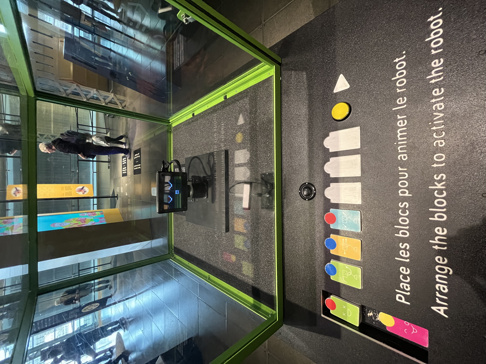
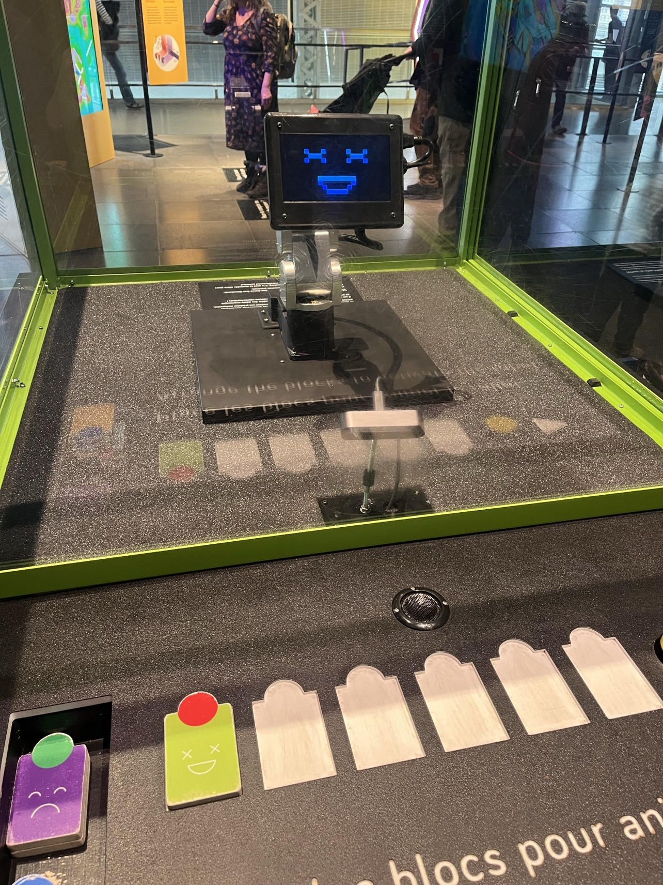
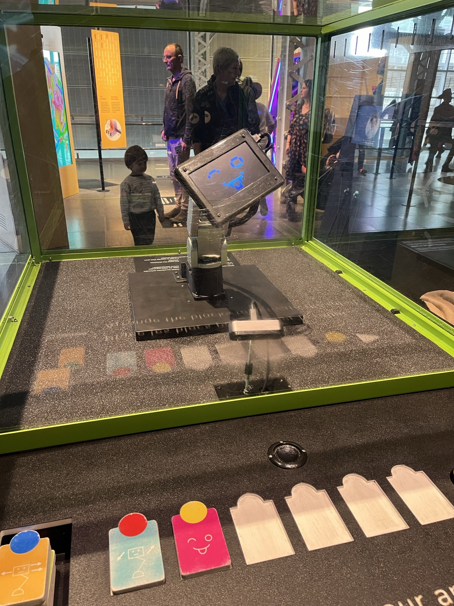
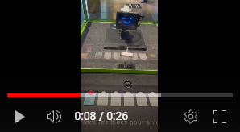

# Centre des sciences de Montréal
## Une expérience chaotique

https://fr.wikipedia.org/wiki/Centre_des_sciences_de_Montr%C3%A9al#/media/Fichier:CentreDesSciences.jpg
### Emplacement 
2 R. de la Commune O, Montréal, QC H2Y 4B2
 

### Date de visite 
10 avril 2024
 

### Oeuvre 
Intéractive 
 

### Date d'ouverture 
6 mai 2000

# Mon appréciation général du Centre des Sciences 
Ma visite au Centre des sciences de Montréal était une aventure à la fois stimulante et chaotique. Dès mon arrivée, j'ai été immédiatement accueilli par une cacophonie de cris et de bruits, une symphonie d'enfants énergiques qui couraient dans tous les sens. Habituellement, je m'attends à une atmosphère plus calme lors de mes sorties, surtout lorsque je suis là pour documenter des dispositifs et des expositions.

Malheureusement, mon immersion dans l'univers de la science a été rapidement perturbée par le bruit environnant. À chaque fois que je tentais de m'approcher d'un dispositif pour l'explorer et le tester, je me retrouvais confronté à une horde d'enfants déjà engagés dans une compétition bruyante pour en être les prochains utilisateurs. Leur enthousiasme était drôle, mais il rendait difficile toute tentative de mener une expérience professionnelle.
À ma grande surprise, j'ai même été confronté à un dispositif émettant des bruits de pets, une touche d'immaturité qui semblait déplacée au milieu d'une telle institution scientifique. Avec une majorité d'enfants présents, cette expérience sonore n'a fait qu'ajouter des cris de plus, loin de l'ambiance propice à la réflexion et à la découverte.
Je dois admettre que malgré le chaos ambiant, les enfants se sont montrés respectueux à leur manière. Dès qu'ils remarquaient ma présence, ils faisaient place, me permettant de m'approcher des dispositifs. 

En tous cas, malgré tout, le Centre des sciences de Montréal offre sans aucun doute une multitude de ressources fascinantes et éducatives. Des expositions interactives aux démonstrations scientifiques en direct, il s'agit d'une destination intéressante pour les amateurs de science de tous âges. Cependant, pour ceux qui recherchent une expérience plus sereine et réfléchie, il peut être préférable de choisir des moments de visite plus calmes, loin des foules de gosses.

En fin de compte, ma sortie au Centre des sciences de Montréal a été mémorable, mais pour des raisons bien différentes de ce que j'avais anticipé. Entre le vacarne et les défis pour accéder aux dispositifs, j'ai été confronté à une réalité inattendue. Cependant, l'esprit de découverte et d'apprentissage reste au cœur de cette expérience, rappelant l'importance de la science dans nos vies, même dans les moments les plus agités.

 

# Le petit robot

Au cœur de tout ça, j'ai découvert un dispositif intrigant qui se démarquait par sa simplicité et son potentiel interactif. Il était dans une vitrine cubique, c'était un petit robot endormi et devant il y avait des blocs colorés disposés dans les creux prévus à le réveiller avec les animations qui le donneront à faire.

Il y avait un message en bas de ces blocs qui est un message à la fois en français et en anglais, qui invitent les visiteurs à participer : "Place les blocs pour animer le robot - Arrange the blocks to activate the robot". Cette simple instruction était un appel à l'action, une incitation à plonger dans le monde interactif et éducatif de cette expérience.

Guidé par ma curiosité, j'ai exploré les possibilités offertes par ce dispositif. Il y avait six creux pour les blocs pour pouvoir animer ce petit robot, chaque combinaison déclenchant une réaction unique de la part de celui-ci. L'interaction était simple.
Manipuler les blocs colorés, les disposer dans les creux désignés, et observer les mouvements du robot qui prenait vie sous mes yeux, étaient des moments de découverte et de rigolade.

Certes, l'ambiance agitée du centre n'a pas disparu complètement, mais elle n'a pas non plus empêché cette expérience d'être amusante. Des enfants curieux se pressaient autour de la vitrine, attirés par l'animation colorée du robot, mais leur présence ajoutait une dimension supplémentaire à cette expérience collective.
En fin de compte, ma rencontre avec ce petit robot dans sa vitrine cubique a été une pause bienvenue dans le chaos du Centre des sciences de Montréal. Je vais à présent montrer comment animer ce petit robot.

#### Voilà deux exemples :

Dans cette première photo, on remarque dans le premier creu, un bloc vert qui illustre ce que le robot va reproduire. Dans ce cas ci, c'est une sourire avec chaque oeil remplacer par un "X".

Dans cette seconde image, on retrouve une nouvelle action du petit robot. Deux blocs distincts attirent l'attention : un bloc bleu, représentant sa première action où le robot semble penché légèrement sur le côté, et un bloc rose, illustrant une expression faciale animée, comme une grimace, ajoutant ainsi une dimension supplémentaire à son animation.

 

# LE DÉBRIF

Mon expérience avec le dispositif interactif du petit robot, logé dans sa vitrine cubique, m'a offert un moment de calme et de concentration au milieu de l'animation ambiante. La simplicité de l'interaction et la fascination de voir le robot prendre vie.

Cependant, il est difficile de dissocier cette expérience isolée de l'ensemble de la visite. Bien que le centre soit animé par toute sorte d'énergie, avec des enfants enthousiastes et des activités foisonnantes, cela n'a pas gâché mon expérience. Au contraire, ça a ajouté une dimension humaine et dynamique à mon exploration, ce qui souligne l'importance de la science comme moteur de curiosité et d'émerveillement pour toutes les générations.

Le Centre des sciences de Montréal demeure un véritable joyau de connaissances et de découvertes. Les expositions interactives, les démonstrations en direct et les expériences pratiques sont autant de portes ouvertes vers un monde fascinant de possibilités scientifiques. Même au milieu de l'activité incessante, l'inspiration et l'apprentissage persistent, rappelant la valeur inestimable de la science dans nos vies et dans la société.

Pour finir cette documentation, voici une petite vidéo qui illustre mon intéraction avec le petit robot.

<https://www.youtube.com/shorts/6VWYY3_qxU0>
