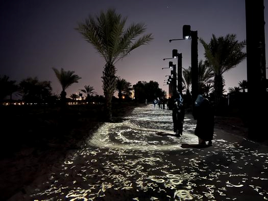
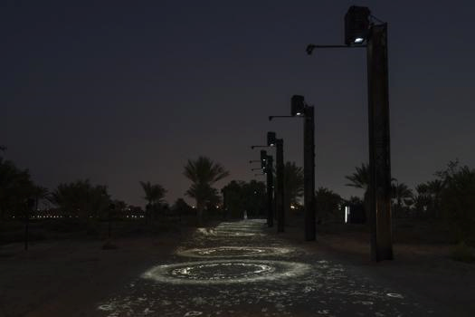

# Compte-rendu de la Conférence
 

## Introduction 
### Présentation de Jade Séguéla
La conférence, animée par Jade Séguéla, une registraire renommée dans le domaine de l'art, a porté sur les coulisses fascinantes de l'installation internationale d'œuvres d'art. Jade, ayant une vaste expérience dans le domaine, a partagé des perspectives uniques sur le processus complexe de préparation, de logistique et d'exécution nécessaires pour mener à bien de tels projets.
 

## Développement
### Exploration des Coulisses de l'Installation
Jade a commencé par présenter le travail de Rafael Lozano-Hemmer, un artiste mexicain de renom. Elle a détaillé le processus rigoureux derrière une de ses œuvres les plus intrigantes, "Translation Island" à Abu Dhabi. Cette installation a nécessité des semaines de travail intensif, avec des équipes travaillant jusqu'à 20 heures par jour, sans week-end. L'installation sur Lulu Island a exigé une planification minutieuse et une adaptation constante, notamment en raison des conditions météorologiques imprévisibles du désert.
 

 
https://www.lozano-hemmer.com/showimage_emb.php?proj=translation_stream&img=abu_dhabi_2023&idproj=1166&type=exhibition&id=19
 

Jade a souligné l'importance des détails techniques dans la réussite de tels projets. Elle a partagé des anecdotes sur la résilience de l'équipe face aux défis imprévus, tels que les tempêtes qui ont endommagé le matériel. De plus, elle a mis en lumière l'aspect humain du processus, en évoquant l'esprit d'équipe et l'humour nécessaire pour maintenir la motivation malgré le stress.

La conférence a également mis en avant la diversité de l'équipe impliquée dans ces projets, composée d'architectes, de programmeurs, d'artistes, de scientifiques et bien d'autres, provenant de différents pays. Cette collaboration multidisciplinaire est essentielle pour garantir le succès des installations artistiques internationales.
 

 
https://www.lozano-hemmer.com/showimage_emb.php?proj=translation_stream&img=abu_dhabi_2023&idproj=1166&type=exhibition&id=8

## Conclusion 
### Mon appréciation 
En conclusion, la conférence de Jade Séguéla a offert un aperçu captivant des défis et des triomphes rencontrés lors de l'installation d'œuvres d'art à l'échelle internationale. Son approche ouverte et engageante a permis aux participants de comprendre la complexité de ce processus, tout en appréciant l'ingéniosité et le dévouement nécessaires pour réaliser de telles réalisations. Cette conférence a été une véritable source d'inspiration pour tous ceux qui aspirent à travailler dans le domaine de l'art et de la culture.
