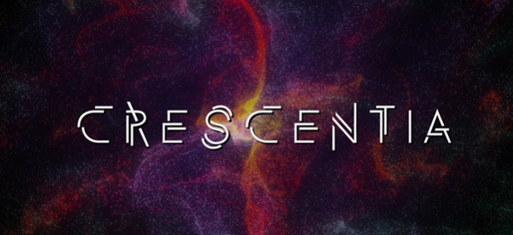

# Crescentia
## L'univers du multimédia au collège Montmorency

https://tim-montmorency.com/2024/
### Emplacement
475 Bd de l'Avenir, Laval, QC H7N 5H9
 

### Date des visites
Le 21 février et le 13 mars
 

### Oeuvre
Intéractive

# Mon appréciation général 
La visite de l'exposition au sein de mon collège, dans le cadre du programme d'intégration multimédia, a été une expérience remarquable et inspirante. Le 21 février et le 13 mars, j'ai eu l'opportunité de découvrir les talents et les créations uniques finales des élèves de mon programme. En tant qu'étudiant moi-même dans ce programme, cette exposition revêtait une importance particulière, offrant un aperçu privilégié de la diversité et du potentiel créatif au sein de notre communauté.

À mon arrivée, j'ai été immédiatement captivé par la profondeur et la variété des œuvres présentées. Chaque groupe d'élèves a pris le temps de partager son processus de création, offrant ainsi une perspective fascinante sur les idées et les inspirations qui sous-tendaient leurs projets. En tant que spectateur, j'ai été impressionné par l'engagement et la passion manifestes derrière chaque création. Je filmait, prenait des photos et des notes des informations dites parce que non seulement c'est intéressant (et le but de cette documentation), mais aussi parce que ces informations là pourront me servir à la fin de cette technique.

Cette exposition a été pour moi l'occasion de voir non seulement les progrès réalisés par ces élèves depuis le début du semestre, mais aussi de me laisser inspirer par leur ingéniosité et leur créativité. Chaque œuvre présentée était le reflet d'un univers artistique unique, témoignant de la richesse des talents présents au sein du programme d'intégration multimédia.

Parmi les différentes œuvres exposées, certaines ont su particulièrement retenir mon attention et m'inspirer, en particulier,"SONALUX". Cependant, même si toutes les créations étaient admirables, il y en avait une qui, personnellement, ne m'a pas autant touché. Malgré cela, je suis reconnaissant envers chaque élève pour son engagement et sa contribution à cette exposition collective.

En résumé, cette visite a été une expérience stimulante et enrichissante, offrant un aperçu précieux de la créativité et du talent au sein de notre communauté d'étudiants en intégration multimédia. En tant que membre de ce programme, je suis reconnaissant d'avoir eu l'opportunité de participer à cet événement et je suis impatient de voir comment nos parcours créatifs continueront à se développer dans les mois à venir.

Je vais maintenant passer en revue chaque équipe et leurs œuvres, en commençant par celles que j'ai moins appréciées pour finir par celles que j'ai préférées.
