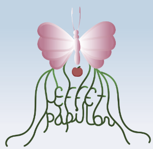
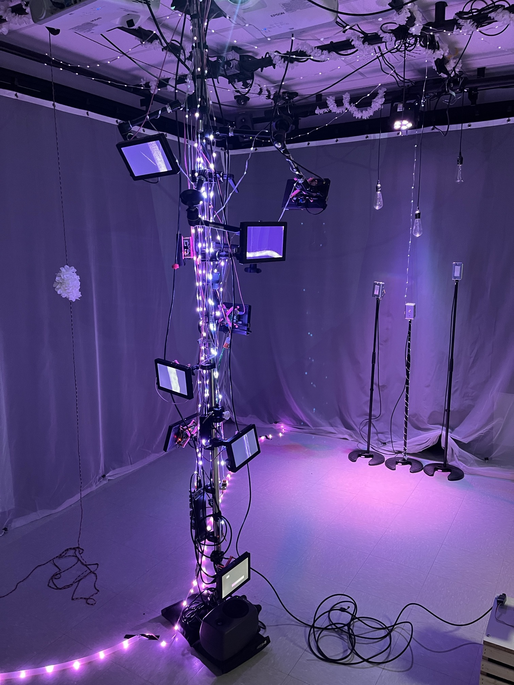
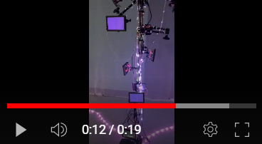
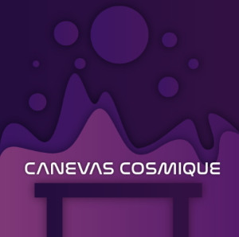
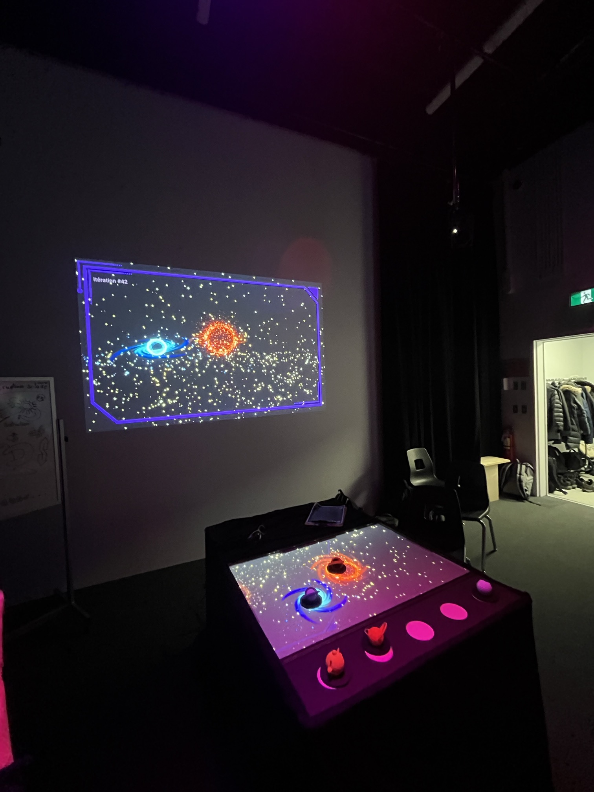
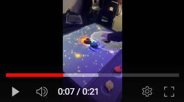
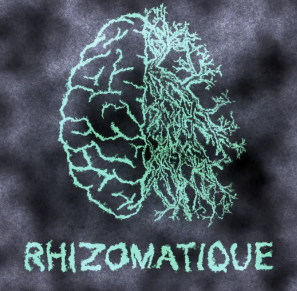
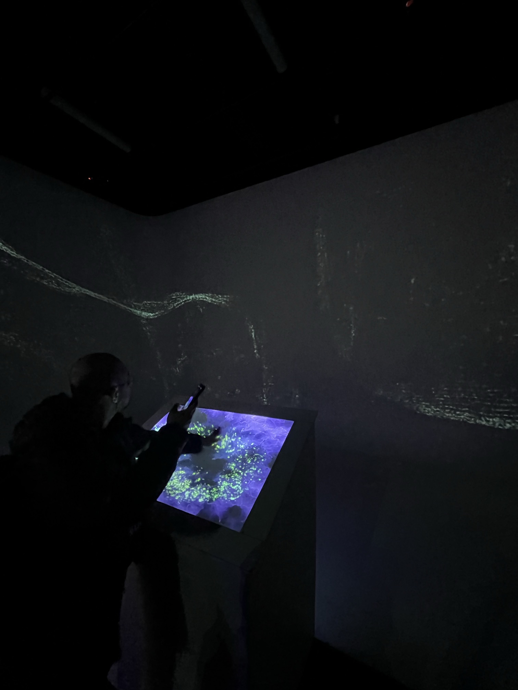
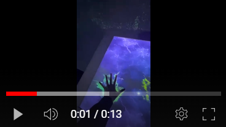

# Crescentia
## L'univers du multimédia au collège Montmorency

https://tim-montmorency.com/2024/
### Emplacement
475 Bd de l'Avenir, Laval, QC H7N 5H9
 

### Date des visites
Le 21 février et le 13 mars
 

### Oeuvre
Intéractive immersive

# Mon appréciation général 
La visite de l'exposition au sein de mon collège, dans le cadre du programme d'intégration multimédia, a été une expérience remarquable et inspirante. Le 21 février et le 13 mars, j'ai eu l'opportunité de découvrir les talents et les créations uniques finales des élèves de mon programme. En tant qu'étudiant moi-même dans ce programme, cette exposition revêtait une importance particulière, offrant un aperçu privilégié de la diversité et du potentiel créatif au sein de notre communauté.

À mon arrivée, j'ai été immédiatement captivé par la profondeur et la variété des œuvres présentées. Chaque groupe d'élèves a pris le temps de partager son processus de création, offrant ainsi une perspective fascinante sur les idées et les inspirations qui sous-tendaient leurs projets. En tant que spectateur, j'ai été impressionné par l'engagement et la passion manifestes derrière chaque création. Je filmait, prenait des photos et des notes des informations dites parce que non seulement c'est intéressant (et le but de cette documentation), mais aussi parce que ces informations là pourront me servir à la fin de cette technique.

Cette exposition a été pour moi l'occasion de voir non seulement les progrès réalisés par ces élèves depuis le début du semestre, mais aussi de me laisser inspirer par leur ingéniosité et leur créativité. Chaque œuvre présentée était le reflet d'un univers artistique unique, témoignant de la richesse des talents présents au sein du programme d'intégration multimédia.

Parmi les différentes œuvres exposées, certaines ont su particulièrement retenir mon attention et m'inspirer, en particulier,"SONALUX". Cependant, même si toutes les créations étaient admirables, il y en avait une qui, personnellement, ne m'a pas autant touché. Malgré cela, je suis reconnaissant envers chaque élève pour son engagement et sa contribution à cette exposition collective.

En résumé, cette visite a été une expérience stimulante et enrichissante, offrant un aperçu précieux de la créativité et du talent au sein de notre communauté d'étudiants en intégration multimédia. En tant que membre de ce programme, je suis reconnaissant d'avoir eu l'opportunité de participer à cet événement et je suis impatient de voir comment nos parcours créatifs continueront à se développer dans les mois à venir.

Je vais maintenant passer en revue chaque équipe et leurs œuvres, en commençant par celles que j'ai moins appréciées pour finir par celles que j'ai préférées.

 

# Effet Papillon

https://tim-montmorency.com/2024/

#### Réalisé par : Raphael Dumont, Aluxis Bolduc, William Morel, Alexia (Ryan) Papanikolaou, Viktor Zhuravlev et Jasmine Lapierre

Le projet "Effet Papillon" s'est présenté comme une expérience immersive au sein de l'exposition. Malheureusement, il a suscité chez moi un sentiment mitigé, voire décevant.

Dès mes deux visites, d'abord le 21 février puis le 13 mars, j'ai constaté une absence significative d'améliorations notables. Les élèves semblaient peu préparés et leur présentation manquait de fluidité, occasionnant même des moments de malaise lorsque certains ajouts étaient envisagés à la hâte. Cette absence de préparation a certainement impacté ma perception globale du projet.

Le concept de base du projet m'est apparu flou, difficile à appréhender. Les dispositifs mis en place, notamment les écrans montés sur une tige avec des boutons pour générer des animations, semblaient manquer de cohérence et d'attrait visuel. Les lumières en forme de girlandes qui ornaient la tige et parcouraient la salle ne parvenaient pas à capter mon attention, et l'ajout d'une poulie pour animer les écrans semblait peu convaincant, voire même de qualité inférieure.

La pièce était principalement éclairée par des luminaires, avec l'ajout de projecteurs et de haut-parleurs diffusant une musique d'ambiance censée créer une atmosphère immersive. Cependant, malgré ces éléments, l'ensemble n'a pas réussi à susciter en moi un réel intérêt ou une immersion totale dans le concept.

L'absence de complétude du projet a été particulièrement frappante lors de ma deuxième visite. Malgré le temps écoulé entre les deux présentations, le projet semblait toujours inachevé, laissant une impression d'inachèvement et de manque de professionnalisme.

En conclusion, "Effet Papillon" s'est révélé être un projet peu convaincant et peu engageant. Les idées de base semblaient floues et la réalisation manquait de cohérence et d'attrait. Malgré les intentions louables des étudiants, l'ensemble n'a pas réussi à captiver mon intérêt ni à offrir une expérience immersive satisfaisante.

Voici une video que j'ai capturé pour montrer ce projet

<https://www.youtube.com/shorts/SfgqQxLMQ_w>

 

# Canevas Cosmique 

https://tim-montmorency.com/2024/

#### Réalisé par : Jacob Alarie-Brousseau, Étienne Charron, Jérémy Cholette, Quoc Huy Do, Mikael Tourangeau

Le projet "Canevas Cosmique" nous plonge dans un laboratoire futuriste où une table trône en son centre, captivant notre attention dès le premier regard. Sur l'écran surplombant la table, une simulation d'un système solaire se déploie, offrant une invitation à l'exploration et à l'interaction.

L'équipe derrière cette création nous propose une expérience unique où nous sommes invités à manipuler des statues, déclenchant ainsi différents phénomènes au sein de la simulation. L'idée de pouvoir interagir avec un système solaire virtuel en déposant des objets sur une table crée une intrigue immédiate et promet une expérience immersive.

Dès ma première rencontre avec ce projet le 21 février, j'ai été intrigué par la vision artistique et l'aspect interactif qu'il proposait. À cette époque, les objets utilisés pour interagir avec la simulation étaient des feuilles en papier, chacune portant un code unique. Cependant, lors de ma deuxième visite le 13 mars, j'ai pu constater une amélioration significative de cette composante. Les feuilles en papier ont été remplacées par des objets en forme de planètes, offrant ainsi une expérience plus immersive et visuellement captivante.

De plus, j'ai remarqué un souci du détail et de la professionnalisme de la part de l'équipe. Lors de ma première visite, les câbles jonchaient le sol de manière désordonnée, ce qui pouvait parfois perturber l'immersion. Cependant, lors de ma deuxième visite, j'ai été agréablement surpris de constater que les câbles avaient été soigneusement rangés et dissimulés, offrant ainsi une esthétique plus soignée et professionnelle à l'ensemble du projet.

L'équipe en charge du projet s'est également montrée accueillante et enthousiaste à l'idée de partager leur création avec les visiteurs. Leur passion pour leur travail transparaissait dans chaque détail de l'expérience, ce qui contribuait à créer une ambiance chaleureuse et engageante au sein du laboratoire.

En résumé, "Canevas Cosmique" s'est révélé être une expérience enrichissante et divertissante, offrant une fusion unique entre l'art visuel, l'interaction et l'exploration spatiale. Grâce à son évolution et à son attention aux détails, ce projet a su captiver mon intérêt et m'offrir une expérience mémorable au sein de l'exposition.

Voici une vidéo que j'ai capturé pour montrer ce projet

<https://www.youtube.com/shorts/WgOgKFDYMBM>

 

# Rhizomatique

https://tim-montmorency.com/2024/

#### Réalisé par : Jolyanne Desjardins, Maika Désy, Laurie Houde et Felix Testa Radovanovic

Voici une rédaction basée sur la description du projet "Rhizomatique" :

Le projet "Rhizomatique" se présente comme une œuvre interactive d'une profondeur singulière, évoquant une nostalgie et des souvenirs qui ne nous appartiennent pas, mais qui pourtant résonnent en nous. En explorant cette création, on est invité à faire un pas en arrière dans le tourbillon incessant du temps, une pause où l'humain et le temps se rejoignent dans un ballet émotionnel et visuel.

Dans notre société contemporaine, le temps exerce un contrôle inévitable sur nos vies, nous précipitant souvent dans un flux incessant d'activités et d'obligations. "Rhizomatique" cherche à capturer cette essence temporelle en offrant une expérience où chaque interaction avec la toile est une plongée dans les méandres des souvenirs. En appuyant sur cette toile, l'explorateur est convié à naviguer à travers les méandres du cerveau pour y découvrir les fragments intemporels qui y sont enfouis. Ces souvenirs sont ensuite révélés sur les projections immersives qui ornent les murs environnants.

Cependant, cette plongée dans le passé d'un inconnu n'est pas seulement une contemplation passive. En effet, chaque interaction avec la toile façonne la clarté des souvenirs qui émergent, symbolisant ainsi l'influence de l'explorateur sur la réminiscence de ces moments. Plus l'interaction est profonde, plus les souvenirs deviennent nets, offrant ainsi une expérience personnalisée et réactive à chaque visiteur.

L'œuvre se déploie dans deux espaces interconnectés : la toile, véritable interface entre l'explorateur et les souvenirs, et les projections immersives, qui donnent vie à ces réminiscences sur les murs environnants. La toile elle-même, représentant le cerveau, est le reflet de la complexité et de la fluidité de nos pensées, avec des projections évoquant les méandres rhizomatiques de l'esprit humain.

Au-delà de l'aspect technique, "Rhizomatique" offre également une expérience sensorielle complète, avec une musique d'ambiance en parfaite harmonie avec l'atmosphère de l'œuvre, ajoutant ainsi une dimension supplémentaire à cette expérience immersive et captivante.

En somme, "Rhizomatique" transcende les frontières de l'art interactif pour offrir une expérience profondément émotionnelle et introspective. En explorant les souvenirs d'un autre, on est amené à réfléchir sur notre propre rapport au temps et à la mémoire, offrant ainsi une méditation sur l'essence même de notre humanité et de notre existence.

Voici une vidéo que j'ai capturé pour montrer ce projet

<https://www.youtube.com/shorts/74oVOtIo75g>
