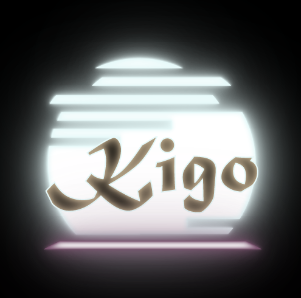
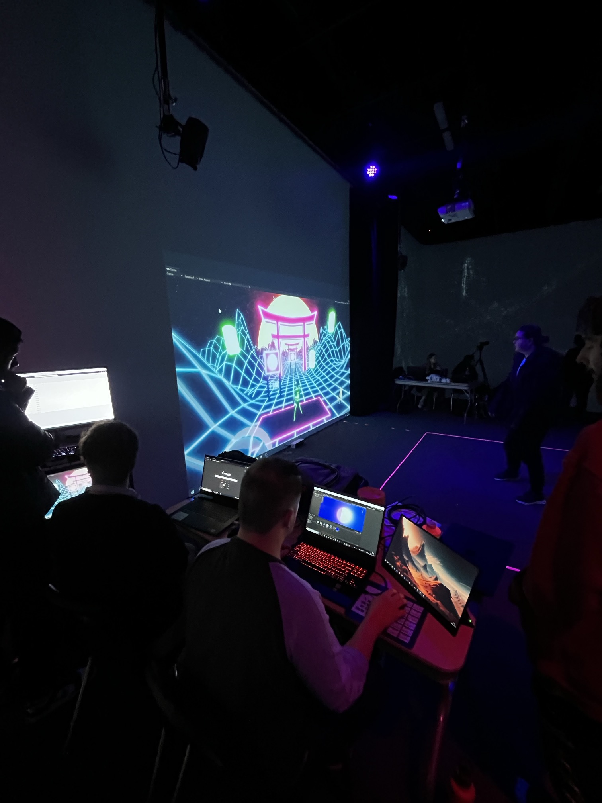
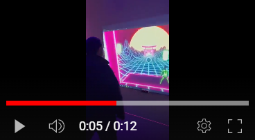

# Crescentia
## L'univers du multimédia au collège Montmorency

https://tim-montmorency.com/2024/
### Emplacement
475 Bd de l'Avenir, Laval, QC H7N 5H9
 

### Date des visites
Le 21 février et le 13 mars
 

### Oeuvre
Intéractive immersive

# Mon appréciation général 
La visite de l'exposition au sein de mon collège, dans le cadre du programme d'intégration multimédia, a été une expérience inspirante pour moi. Le 21 février et le 13 mars, j'ai eu l'opportunité de découvrir les talents et les créations uniques finales des élèves de mon programme. En tant qu'étudiant dans ce programme, ces expositions sont importante pour moi, car ils me donnent un aperçu de ce qui m'attends quand j'en arriverait là et aussi pour voir la diversité et le potentiel créatif de ma communauté.

À mon arrivée, j'ai été immédiatement surpris par des œuvres présentées, je ne m'attendait pas à des grandes oeuvres avec pleins de materiels complexes que je ne comprennait pas du tout et je me demandais comment ils ont penser à tout ça. Chaque groupe d'élèves a pris le temps de partager son processus de création, offrant ainsi les idées et les inspirations qui derrièrent leurs projets. En tant que spectateur, j'ai été impressionné par l'engagement et la passion manifestes derrière chaque création. Je filmait, prenait des photos et des notes des informations dites parce que non seulement c'est intéressant (et le but de cette documentation), mais aussi parce que ces informations là pourront me servir à la fin de cette technique.

Cette exposition a été pour moi l'occasion de voir non seulement les progrès réalisés par ces élèves depuis le début du semestre, mais aussi de me laisser inspirer par leur ingéniosité et leur créativité. Chaque œuvre présentée était le reflet d'un univers artistique unique, et ça m'a montré la richesse des talents présents au sein du programme d'intégration multimédia. J'ai d'ailleurs même pris contact avec certains élèves pour de l'aide lorsque ça seras à mon tour.

Parmi les différentes œuvres exposées, certaines ont su particulièrement retenir mon attention et m'inspirer, en particulier"SONALUX". Cependant, même si toutes les créations étaient intéressante, il y en avait une qui, personnellement, ne m'avais pas autant touché. Malgré cela, je suis reconnaissant envers chaque élève pour son engagement et sa contribution à cette exposition collective.

Je vais maintenant passer en revue chaque équipe et leurs œuvres, en commençant par celles que j'ai moins appréciées pour finir par celles que j'ai préférées.

 

# Effet Papillon

https://tim-montmorency.com/2024/

#### Réalisé par : Raphael Dumont, Aluxis Bolduc, William Morel, Alexia (Ryan) Papanikolaou, Viktor Zhuravlev et Jasmine Lapierre

Le projet "Effet Papillon" s'est présenté comme une expérience immersive au sein de l'exposition. Malheureusement, à mes yeux c'était pas intéressant.

Dès mes deux visites, d'abord le 21 février puis le 13 mars, j'ai remarqué une absence d'améliorations visibles. Les élèves semblaient peu préparés et leur présentation manquait de fluidité, occasionnant même des moments de malaise. Cette absence de préparation a certainement impacté ma perception genérale du projet.

Je trouvais le concept de base du projet bizarre, flou et difficile à comprendre. Les dispositifs mis en place, notamment les écrans montés sur une tige avec des boutons pour générer des animations manquaient de cohérence et d'attrait visuel. Les lumières en forme de girlandes qui étaient sur la tige et parcouraient la salle ne captais pas vraiment mon attention, et l'ajout d'une poulie pour animer les écrans semblait peu convaincant, voire même cheap à mon avis.

La pièce était principalement éclairée par des luminaires, avec l'ajout de projecteurs et de haut-parleurs diffusant une musique d'ambiance censée créer une atmosphère immersive. Cependant, malgré ces éléments, l'ensemble n'a pas réussi à susciter en moi un réel intérêt ou une immersion totale dans le concept.

J'avais une impression que leur travail n'était pas totalement fini et cette impression avait l'air encore plus vrai lors de ma deuxième visite. Malgré le temps écoulé entre les deux présentations, le projet semblait toujours inachevé, laissant une impression d'inachèvement et de manque de professionnalisme.

"Effet Papillon" s'est révélé être un projet peu convaincant et peu engageant. Les idées de base semblaient floues et la réalisation manquait de cohérence et d'attrait. Malgré les intentions des étudiants, l'ensemble n'a pas réussi à captiver mon intérêt ni à offrir une expérience immersive satisfaisante.

<https://www.youtube.com/shorts/SfgqQxLMQ_w>

 

# Canevas Cosmique 

https://tim-montmorency.com/2024/

#### Réalisé par : Jacob Alarie-Brousseau, Étienne Charron, Jérémy Cholette, Quoc Huy Do, Mikael Tourangeau

Le projet "Canevas Cosmique" nous montre une table au centre qui captivent notre attention dès le premier regard. Sur l'écran en face de la table on voient une simulation d'un système solaire qui est assez beau à voir honnêtement et ça donnent l'envie d'intéragir avec cette oeuvre.

L'équipe derrière cette création nous propose une expérience unique où nous sommes invités à manipuler des statues qui déclenchent ainsi différents phénomènes lors de la simulation. L'idée de pouvoir interagir avec un système solaire virtuel en déposant des objets sur une table est intéressant et promet une expérience immersive.

Dès ma première rencontre avec ce projet le 21 février, j'ai été intrigué par la vision artistique et l'aspect interactif qu'il proposait. À cette première visite, les objets utilisés pour interagir avec la simulation étaient des feuilles en papier, chacune portant un code unique. Cependant, lors de ma deuxième visite le 13 mars, j'ai remarqué une amélioration significative de ces bouts de papier. Les feuilles en papier ont été remplacées par des objets en forme de planètes, offrant ainsi une expérience plus immersive et visuellement captivante.

De plus, j'ai remarqué un souci du détail et de la professionnalisme de la part de l'équipe. Lors de ma première visite, les câbles étaient sur le sol de manière désordonnée, ce qui pouvait parfois perturber l'immersion. Cependant, lors de ma deuxième visite, j'ai été agréablement surpris de constater que les câbles avaient été soigneusement rangés et dissimulés, offrant ainsi une esthétique plus soignée et professionnelle à l'ensemble du projet.

L'équipe en charge du projet s'est également montrée accueillante et enthousiaste à l'idée de partager leur création avec les visiteurs. Leur passion pour leur travail était présente ce qui contribuait à créer une ambiance chaleureuse et engageante au sein du laboratoire.

En résumé, "Canevas Cosmique" s'est révélé être une expérience enrichissante et divertissante avec une fusion unique entre l'art visuel, l'interaction et l'exploration spatiale. Grâce à son évolution et à son attention aux détails, ce projet a su garder mon intérêt et m'a offert une expérience intéressante au sein de l'exposition.

<https://www.youtube.com/shorts/WgOgKFDYMBM>

 

# Rhizomatique

https://tim-montmorency.com/2024/

#### Réalisé par : Jolyanne Desjardins, Maika Désy, Laurie Houde et Felix Testa Radovanovic

Le projet "Rhizomatique" se présente comme une œuvre interactive qui évoquent une nostalgie et des souvenirs qui ne nous appartiennent pas, mais qui pourtant résonnent en nous. 

L'équipe derrière ce projet nous explique que dans notre société, le temps exerce un contrôle inévitable sur nos vies et nous précipitant souvent dans un flux incessant d'activités et d'obligations. "Rhizomatique" cherche à capturer cette essence temporelle en offrant une expérience où chaque interaction avec la toile est une plongée dans des souvenirs. La personne qui appui sur cette toile, navigue à travers le cerveau pour y découvrir les fragments de souvenirs qui y sont enfouis. Ces souvenirs sont ensuite révélés sur les projections immersives  des murs autour.

Chaque interaction avec la toile façonne la clarté des souvenirs qui en sortent, symbolisant ainsi l'influence de l'explorateur sur la réminiscence de ces moments. Plus l'interaction est profonde, plus les souvenirs deviennent nets, ce qui offrent ainsi une expérience personnalisée et réactive à chaque visiteur.

L'œuvre se déploie dans deux espaces interconnectés : la toile qui est interface entre l'explorateur et les souvenirs, et les projections immersives, qui donnent vie à ces réminiscences sur les murs environnants. La toile elle-même, représentant le cerveau, est le reflet de la complexité et de la fluidité de nos pensées, avec des projections évoquant les rhizomatiques de l'esprit humain. 

Au-delà de l'aspect technique, "Rhizomatique" offre également une expérience sensorielle complète, avec une musique d'ambiance en parfaite harmonie avec l'atmosphère de l'œuvre, ajoutant ainsi une dimension supplémentaire à cette expérience immersive et captivante.

En somme, "Rhizomatique" transcende les frontières de l'art interactif pour offrir une expérience profondément émotionnelle et introspective. En explorant les souvenirs d'un autre, on est amené à réfléchir sur notre propre rapport au temps et à la mémoire, offrant ainsi une méditation sur l'essence même de notre humanité et de notre existence, oui, c'est très philosophique, du moins c'est ce que je trouve. 

<https://www.youtube.com/shorts/74oVOtIo75g>

 

# KIGO

https://tim-montmorency.com/2024/

#### Réalisé par : Érick Ouellette, William Rathier Mailly, Gabriel Clerval, Nicolas St-Martin et Antoine Dion

Le projet "Kigo" se démarque des autres par son approche amusante, elle offre une expérience de jeu captivante qui a su raviver en moi des souvenirs d'enfance, notamment mes moments passés à jouer avec la Kinect. Kigo est conçu comme un jeu interactif qui invite le joueur à naviguer à travers un univers néon rétro, en évitant des obstacles tandis que l'esthétique visuelle évolue pour refléter les quatre saisons.

L'équipe derrière cette création a réussi à améliorer l'aspect visuel du jeu entre les deux dates de présentation, offrant ainsi une expérience encore plus immersive et esthétiquement plaisante. En ce qui concerne la détection des mouvements, bien que j'aie constaté quelques légers bugs occasionnels, ceux-ci n'ont pas nui à la fonctionnalité globale du jeu. De plus, la présence d'une section bien illustrée pour indiquer les limites de l'espace de détection a contribué à faciliter l'expérience du joueur et à minimiser les perturbations.

Ce qui m'a particulièrement marqué avec "Kigo", c'est la dimension sociale qu'il offre. Contrairement aux autres œuvres où je me concentrais principalement sur mon expérience personnelle, j'ai pris un réel plaisir à observer les autres joueurs s'immerger dans le jeu et tenter de battre leur propre score. L'ambiance conviviale de cette expérience en faisait un véritable moment de plaisir partagé avec mes camarades de classe.

Par ailleurs, l'esthétique visuelle du jeu est un véritable point fort, avec des graphismes néon rétro comme je l'ai mentionné qui captent immédiatement l'attention et plongent le joueur dans un univers visuellement saisissant. L'équipe en charge du projet, située à proximité pour contrôler l'ordinateur central, a su créer une atmosphère accueillante et stimulante, contribuant ainsi à renforcer l'immersion du joueur dans l'univers de "Kigo".

"Kigo" s'est révélé être une expérience mémorable et divertissante, offrant une fusion parfaite entre nostalgie personelle, plaisir de jeu et esthétique visuelle saisissante. Cette œuvre a su captiver mon attention et m'offrir un moment de pur divertissement au cœur de l'exposition.

Voici une vidéo que j'ai capturé pour montrer ce projet

<https://www.youtube.com/shorts/tq9hsVdQytg> 
