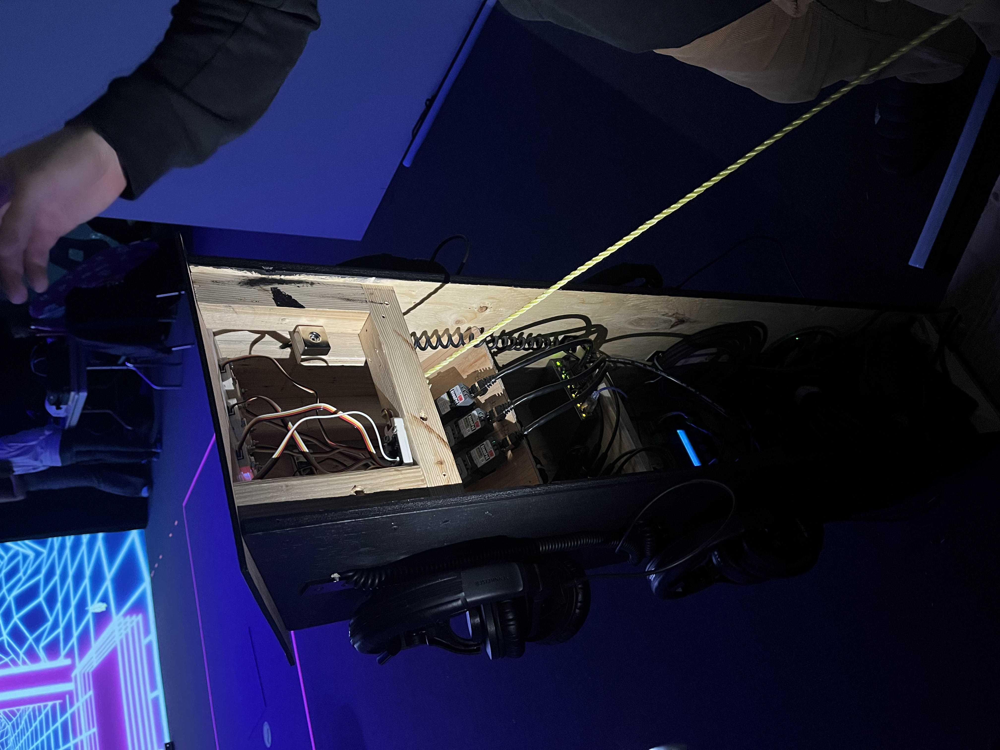
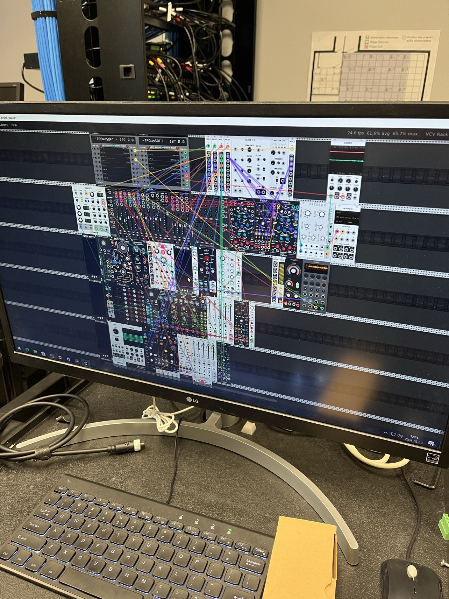
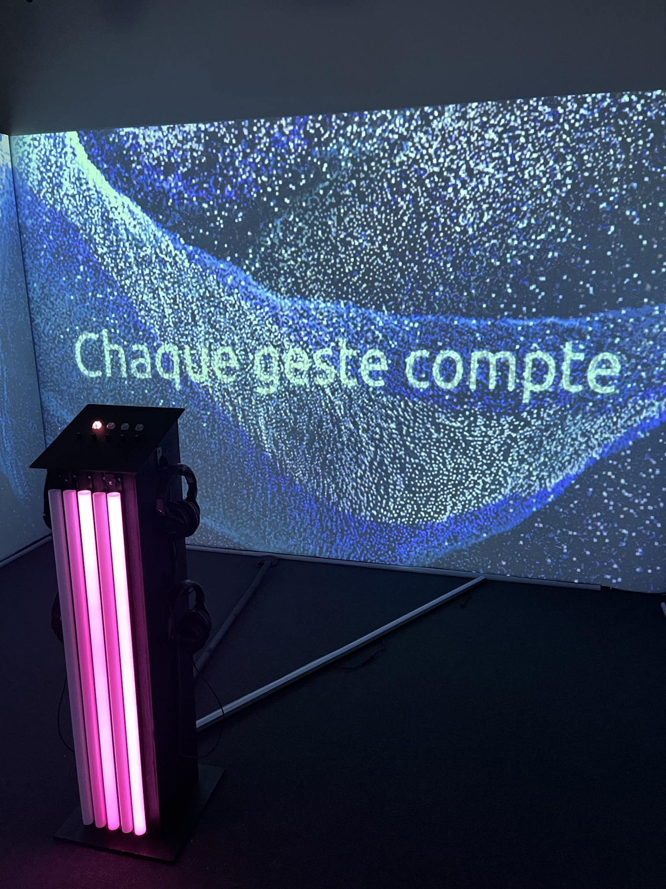
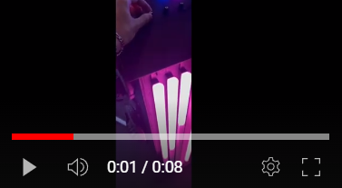

# SONALUX
### Une oeuvre réalisé par : Antoine Haddad, Camélie Laprise, Ghita Alaoui et Vincent Desjardins

https://tim-montmorency.com/2024/

L'installation Sonalux est une expérience qui selon moi, est la meilleure parmi toutes les autres oeuvres. On est maître de son propre voyage à travers la manipulation des instruments disposés sur un podium central. 

Ce podium, est le cœur de l'expérience et est équipé de quatre boutons situés en haut. Chaque bouton produit un son spécifique lorsqu'il est activé. Au bas de ces boutons on retrouve des molettes qui permettent de moduler l'intensité sonore des différentes couches musicales, offrant ainsi une palette infinie de possibilités sonores. Tout au long de l'expérience, la personne ou les personnes parce qu'il fournissent plus de un casque, est accompagné d'un casque audio qui l'immerge totalement dans cet univers sonore envoûtant.Je trouve que à deux personnes ça rajoute un charme supplémentaire, c'est différent, mais c'est toujours aussi intéressant.

Ce qui rend cette expérience encore plus captivante, c'est la liberté offerte à la personne qui intéragit pour créer sa propre musique. Dès le premier jour j'ai direct senti un similitude avec un jeu du nom de Incredibox que j'ai jouer plusieurs fois. J'ai même demandé à un membre si ce jeu était une inspiration et sans surprise il me l'a confirmé. Sonalux permet à chacun de laisser sa créativité prendre le devant en expérimentant avec les différents sons et en modulant leur intensité selon ses envies. L'ambiance immersive est renforcée par un superbe visuel esthétique, avec un podium noir illuminé par des tubes mauves qui réagissent à l'intensité des sons joués. Les tubes lumineux disposés au sol ajoutent une dimension supplémentaire à cette expérience sensorielle, créant ainsi un spectacle visuel en parfaite harmonie avec la musique.

J'ai intéragit avec Sonalux lors de deux visites, le 21 février et le 13 mars, et j'ai directement remarqué une évolution significative au niveau esthétique entre les deux présentations. En effet, lors de ma première visite, le podium était pas beau visuellement. Il était en bois non peint et avec des câbles qui dépassent, tandis que les boutons semblaient nus. Cependant, malgré cette apparence initiale, j'ai tout de suite vu le potentiel de l'installation et je n'ai pas été déçu. L'amélioration esthétique apportée lors de ma seconde visite a véritablement valorisé l'expérience, renforçant ainsi l'impact visuel et émotionnel de Sonalux. C'est, à mon avis parmis toutes les oeuvres les améliorations les plus impactante. Un membre m'a également montrer l'intérieur du podium pour voir comment tout fontionne. 

De plus celui-ci m'a également montré l'ordinateur derrière tout ça

Enfin, un détail qui a particulièrement marqué mon expérience est le message affiché dès le début de l'expérience : "Chaque geste compte". Ce message, accompagné d'une animation qui longe les murs, renforce l'idée que chaque action de l'explorateur a un impact sur l'univers sonore qui l'entoure et ainsi cette simple oeuvre peut nous donner une réflexion profonde sur notre capacité à influencer notre environnement.

En résumé, Sonalux est une expérience véritablement magique et immersive qui offrent une fusion parfaite entre musique, interaction et esthétique visuelle. Son univers infini de possibilités sonores et sa beauté esthétique en font une expérience incontournable au sein de l'exposition de Crescentia.

<https://youtube.com/watch?v=n89WEw6I1BA> 
