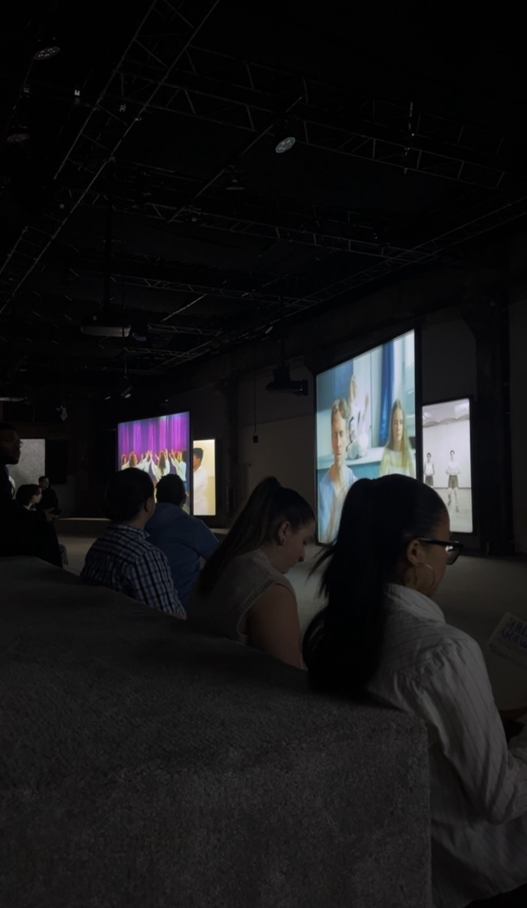
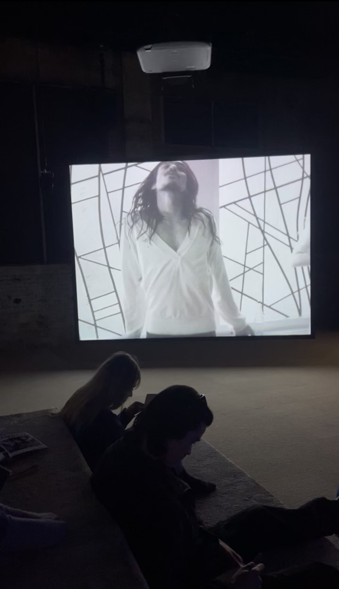

# Phase Shifting Index
## Par Jeremy Shaw

 

## Fonderie Darling

 

Emplacement : 745 Rue Ottawa Montréal Quebec
 

Date de visite : 31 janvier 2024

## PHASE SHIFTING INDEX

 

# Ma critique
L'œuvre de Jeremy Shaw, "Phase Shifting Index", est véritablement une expérience multisensorielle captivante qui ne manque pas de susciter l'intérêt et l'admiration. À travers l'usage innovant de sept écrans et d'une composition sonore immersive, Shaw réussit à transcender les frontières de la perception conventionnelle pour offrir un voyage fascinant à travers des états de conscience altérés.

L'une des caractéristiques les plus marquantes de cette œuvre réside dans son traitement sonore singulier. La musique enveloppante et les sons hypnotiques créent une atmosphère envoûtante qui accompagne parfaitement les images en constante mutation. C'est une fusion harmonieuse entre le visuel et l'auditif, où chaque composante semble synchronisée de manière impeccable pour amplifier l'expérience du spectateur.

Les sept écrans qui ornent l'espace confèrent une dimension supplémentaire à l'œuvre, invitant le spectateur à explorer différentes perspectives et angles de narration. Cependant, il est regrettable que le septième écran n'ait pas été fonctionnel au début de la présentation. Cette lacune technique a sans doute entravé l'expérience immersive, privant les spectateurs d'une partie de la narration visuelle. Néanmoins, même avec cette imperfection initiale, l'œuvre parvient toujours à captiver et à intriguer par sa complexité et sa profondeur.

L'un des aspects les plus remarquables de l'expérience est le confort qu'elle procure. Le fait d'être en chaussettes crée une atmosphère décontractée et intime, permettant aux spectateurs de se sentir pleinement immergés dans l'univers de l'œuvre. De plus, le choix délibéré de l'emplacement des sièges et le design de l'espace offrent un confort supplémentaire, permettant aux spectateurs de se plonger totalement dans la contemplation de l'œuvre.

Un autre élément qui contribue à l'unicité de cette expérience est l'interaction subtile entre les spectateurs eux-mêmes. Le mouvement des têtes qui se tournent pour suivre chaque écran crée une dynamique sociale intéressante, renforçant le sentiment de communauté parmi les spectateurs partageant cet instant particulier.

 

 

Un aspect ludique et enrichissant de l'expérience "Phase Shifting Index" est l'observation des réactions des autres spectateurs qui partagent cet espace d'exploration artistique. Il est fascinant de voir comment chacun réagit aux différentes séquences visuelles et sonores, et de remarquer les expressions d'émerveillement, de concentration ou de contemplation sur les visages des autres visiteurs. De plus, le fait de voir les autres spectateurs prendre des notes ou réagir de manière similaire à certains moments crée un sentiment de connexion et de partage dans l'appréciation de l'œuvre. Cette dimension sociale ajoute une couche supplémentaire à l'expérience globale, renforçant le sentiment de communauté parmi les spectateurs et enrichissant ainsi la compréhension et l'appréciation de l'œuvre de Jeremy Shaw.

  

