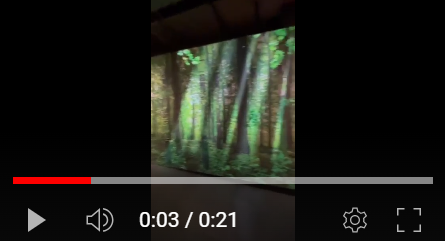

# Savoir, Trauma, Résilience
## Voix autochtones d'aujoud'hui

Le Musée McCord est un musée situé au centre ville de Montréal et ce musée est une très belle trouvaille, merci à mon cours d'oeuvres. Le 3 mars 2024, je suis allé voir l'exposition permanente intitulée "Voix Autochtones d'Aujourd'hui : Savoir, Trauma, Résilience". J'ai profité du moment pour voir les autres oeuvres que ce musée a à offrir et je les ait également documenté. Cela dit, la documentation ci présente reflète une exposition qui vient d'un contexte délicat, celui de partager les savoirs souvent méconnus des peuples autochtones du Québec et du Canada et leurs blessures historiques profondes ainsi que leur forte résilience que je respecte énormément. Mes cours d'histoire étaient les plus ennuyeux et je le dit sans gêne, cela dit, dès qu'il était sujet d'autochtones, je devenait automatiquement concentrer et je traite de pourquoi c'était le cas plus bas dans cette docuementation.

Dès mon arrivée, j'ai été captivé par la diversité des sections de l'exposition, mettant en lumière des thématiques essentielles telles que le savoir autochtone, l'héritage culturel, le traumatisme historique et la résilience communautaire. Une des pièces maîtresses de cette exposition réside dans les témoignages poignants recueillis par la commissaire huronne-wendat, Elisabeth Kaine. Cette dernière a mené une consultation approfondie entre 2010 et 2018, échangeant avec plus de 800 individus issus des 11 nations autochtones du Québec. Ces récits, empreints d'authenticité, sont le fruit d'ateliers participatifs, offrant ainsi une voix directe aux Autochtones de diverses nations. Ces informations se trouvait à l'entrée de l'exposition.

<https://www.youtube.com/shorts/01dx2IF_bq4> 

Parmi les œuvres qui ont particulièrement retenu mon attention, et celle que je me devait de documenter, se trouve un dispositif multimédia très intéressant. Au centre de la pièce, un écran diffuse des témoignages poignants, dont celui de Joséphine Bacon, une Innu dont les paroles résonnent avec une force inégalée. Autour de cet écran, des projections de végétation et d'arbres ornent les murs, créant une atmosphère immersive qui amplifie l'impact des récits partagés. Cette combinaison entre les témoignages audiovisuels et les éléments visuels environnants offre une expérience profondément engageante et émouvante. Voici une vidéo que j'ai pris lors du témoignage de Joséphine Bacon.

https://www.youtube.com/shorts/2qPMNQpGDq4

La contribution de La Boîte Rouge VIF, un organisme autochtone à but non lucratif, a été cruciale dans la réalisation des capsules vidéo présentant les nombreux témoignages. Leur générosité et leur engagement ont permis de donner vie aux récits émouvants des individus qui partagent leurs expériences, leurs savoirs et leurs souffrances. Après ce dispositif se trouvaient d'ailleurs d'autres dispositifs similaires ou écrans avec le même principe de sensibiliser la cause et d'éduquer les personnes qui ne savent rien du sujet. 

Ma visite au Musée McCord a été bien plus qu'une simple exploration artistique. C'était une immersion émotionnelle dans un univers de mémoire collective. En m'habillant aux couleurs de l'œuvre que je m'apprêtais à documenter, j'ai ressenti un lien intime avec le sujet, une connexion qui a enrichi chaque instant de ma visite. Les témoignages poignants m'ont profondément touché, suscitant en moi une réflexion profonde sur l'histoire souvent douloureuse mais incroyablement inspirante des peuples autochtones.
En évaluant l'exposition, plusieurs points positifs se dégagent. La mise en valeur de la diversité des voix autochtones est un aspect essentiel de cette expérience, tout comme la qualité de présentation des œuvres et des dispositifs multimédias. De plus, l'importance des thématiques abordées ne peut être sous-estimée et offre une occasion précieuse de sensibilisation et de dialogue.

Ma décision de documenter l'exposition autochtone découle d'une passion de longue date pour ce sujet. Depuis mon enfance, j'ai été attiré par les récits et les histoires des peuples autochtones, trouvant dans leur histoire une source d'inspiration et de fascination. Des documentaires visionnés avec ma mère ou encore des jeux vidéo tels que Assassin's Creed 3, chaque expérience a contribué à forger mon intérêt profond pour la culture et la résilience autochtones.

En parcourant cette exposition, nous sommes invités à entamer un dialogue essentiel, à reconnaître l'importance de la collaboration et de la compréhension mutuelle pour un avenir partagé. Il s'agit de recoller les fragments de notre histoire interrompue, de panser les plaies encore ouvertes causées par des siècles de marginalisation et de discrimination. Cette exposition nous rappelle que la réconciliation commence par la reconnaissance de la diversité et la valorisation de chaque voix, chaque histoire, chaque savoir autochtone. Étant une personne dans la minorité et qui a déjà du passer par des moments de discriminations raciste, il est de mon devoir de vouloir sensibiliser une cause qui est avant tout une cause pour l'humanité.
